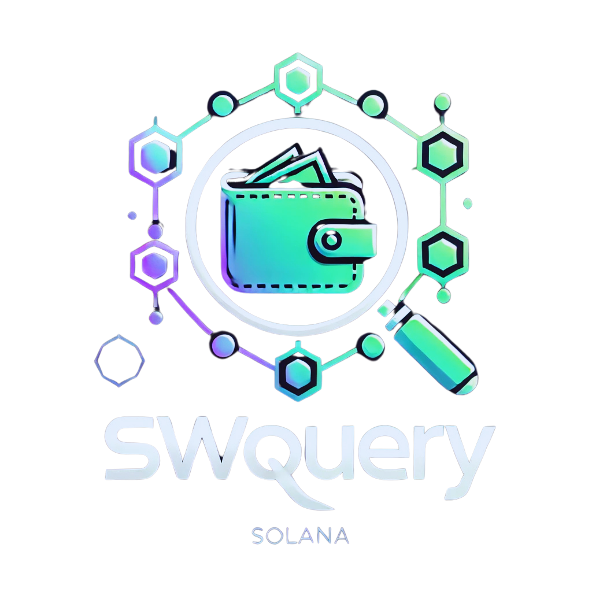
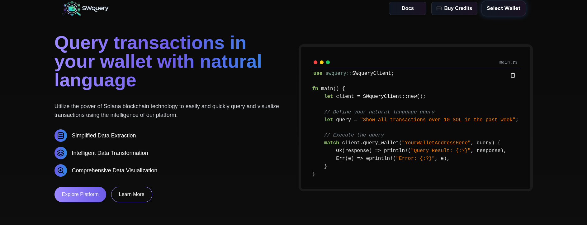
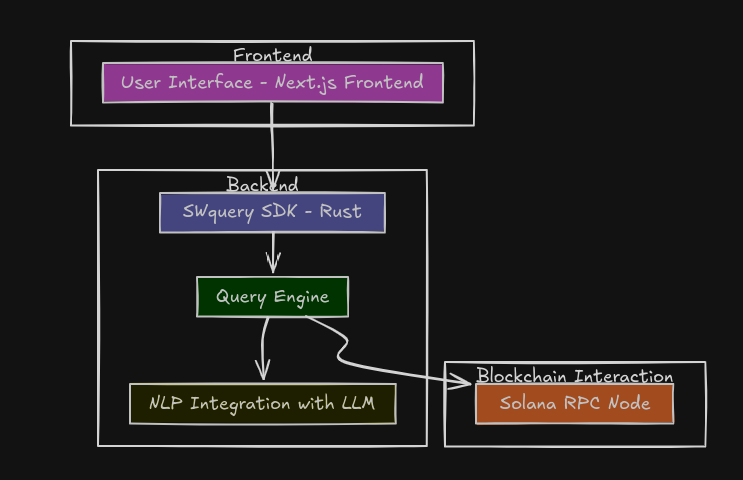

**🔍 SWquery: Smart Wallet Query**

<h1 align="center">
    <a href="https://github.com/swquery">
        
    </a>
</h1>

<p align="center">
    <i>"Connecting intelligence and accessibility to the world of blockchain transactions."</i>
</p>

<p align="center">
    
</p>

---

## **📜 About the Project**

**SWquery** (Smart Wallet Query) is an innovative solution that simplifies interaction with transactions on the Solana blockchain. It offers a user-friendly interface and a versatile SDK in Rust, integrating natural language processing (NLP) to make blockchain queries intuitive and accessible.

---

## **🚨 The Problem**

Blockchain is powerful but presents challenges:

-   **Complex Data**: On-chain transactions are difficult for non-technical users to interpret.
-   **Lack of Accessible Tools**: Existing solutions require advanced technical knowledge.
-   **Difficulty in Customization**: Few tools offer modular integration or customizable interfaces.

These barriers limit adoption and efficiency for both users and developers.

---

## **💡 Our Solution**

**SWquery** addresses these challenges with:

-   **Natural Language Queries**: Ask _"What were my transactions greater than 10 SOL in the last week?"_ and receive clear and structured responses.
-   **Intelligent Chatbot**: An integrated assistant that helps in visualization and customization of queries.
-   **SDK in Rust**: A toolkit for developers to create customized solutions.
-   **Real-Time Notifications**: Receive automatic alerts of important transactions directly in the interface.

---

## **🎯 Use Cases**

### **1. End User**

-   **Problem**: Difficulty in understanding blockchain transactions.
-   **Solution**: Use **SWquery** to query _"Which transactions involve more than 100 USDC in the last 30 days?"_ and receive a detailed visual summary.

### **2. Developers**

-   **Problem**: Need to integrate on-chain data into their applications.
-   **Solution**: The SDK allows easy access to transactions and metadata, optimized for robust integrations.

### **3. Companies**

-   **Problem**: Monitoring transactions in real time.
-   **Solution**: Utilize notifications for instant alerts of on-chain events.

---

## **🌟 Features**

-   **Natural Language**: Perform intuitive queries directly on the blockchain.
-   **Customized Chatbot**: Assist users with explanations and actions based on their data.
-   **Modular SDK**: Complete tools for developers to use in any application.
-   **Interactive Visualizations**: Graphs and tables to facilitate transaction analysis.

---

## **🛠️ Technologies Used**

| Technology  | Usage                           |
| ----------- | ------------------------------- |
| **Rust**    | SDK for integration with Solana |
| **Next.js** | Interactive frontend            |
| **OpenAI**  | Natural language processing     |

---

## **🔧 Architecture Diagram**

<p align="center">
    
</p>

---

## **📦 How to Use**

### **1. Installing the SDK**

Add the SWquery SDK to your project by including the following in your `Cargo.toml`:

```toml
[dependencies]
swquery = "0.0.2"
```

Alternatively, run the command:

```bash
cargo add swquery
```

Then, build the project:

```bash
cargo build
```

### **2. Initializing the Client**

To start using the SWquery SDK, initialize the `SWqueryClient` with your API keys and configuration.

```rust
use swquery::SWqueryClient;
use std::time::Duration;

#[tokio::main]
async fn main() {
    let client = SWqueryClient::new(
        "YOUR_AGENT_API_KEY".to_string(),
        "YOUR_HELIUS_API_KEY".to_string(),
        Some(Duration::from_secs(10)),
        None,
    );
}
```

### **3. Basic Query to Fetch Transactions**

You can easily fetch transactions for a specific wallet by passing natural language queries.

```rust
let response = client
    .query("Get transactions above 10 SOL", "YourWalletAddress")
    .await
    .unwrap();

println!("Response: {:#?}", response);
```

## **Common Errors and Troubleshooting**

-   **Invalid API Key**: Ensure the `api_key` and `helius_api_key` are correct and have sufficient permissions.
-   **Timeout Issues**: Increase the timeout during initialization if API calls are timing out.
-   **Invalid Address**: Ensure wallet addresses are in the correct Solana format.

## **Advanced Configuration**

You can adjust the network and timeout settings to fit your requirements:

```rust
let client = SWqueryClient::new(
    "YOUR_AGENT_API_KEY".to_string(),
    "YOUR_HELIUS_API_KEY".to_string(),
    Some(Duration::from_secs(20)),   // Custom timeout
    Some(Network::Devnet),           // Use Solana Devnet
);
```

This enables fetching data from the Solana **Devnet** instead of the default **Mainnet**.

With these steps, you are ready to integrate blockchain intelligence directly into your applications using the SWquery SDK. 🚀

---

## **🌳 Project Structure**

```
.
├── ai-agent
│   ├── configs
│   ├── controllers
│   ├── middlewares
│   └── services
├── credit-sales
│   └── src
│       ├── instructions
│       ├── state
│       └── tests
├── deployment
│   └── server
│       └── database
├── frontend
│   ├── public
│   └── src
│       ├── app
│       ├── components
│       ├── lib
│       ├── providers
│       └── services
├── server
│   ├── database
│   └── src
│       ├── models
│       └── routes
└── swquery
    └── src
        ├── llm
        ├── models
        └── utils.rs
```

-   **ai-agent**: Python services and controllers for AI-related functionality.
-   **credit-sales**: Rust program handling on-chain credit operations.
-   **deployment**: Configuration for container orchestration and database setup.
-   **frontend**: Next.js project for the web interface, components, and assets.
-   **server**: Rust backend server code, database migrations, and routes.
-   **swquery**: Core SDK logic in Rust, including NLP functionalities.
-   **test-ts**: TypeScript-based tests and supporting infrastructure.

---

## **👥 Our Team**

<table>
  <tr>
    <td align="center">
      <a href="https://www.linkedin.com/in/arthur-bretas/">
        <br>
        <sub><b>Arthur Bretas</b></sub>
      </a>
    </td>
    <td align="center">
      <a href="https://www.linkedin.com/in/marcelofeitoza7/">
        <br>
        <sub><b>Marcelo Feitoza</b></sub>
      </a>
    </td>
     <td align="center">
      <a href="https://www.linkedin.com/in/victor-severiano-de-carvalho/">
        <br>
        <sub><b>Victor Carvalho</b></sub>
      </a>
    </td>
     <td align="center">
      <a href="https://www.linkedin.com/in/pedro-hagge/">
        <br>
        <sub><b>Pedro Hagge</b></sub>
      </a>
    </td>
  </tr>
</table>

---

<p align="center">Made with ❤️ by the SWquery team 🚀</p>
